# One-step mobile-network traffic forecasting in Milan

**Christian Tonny | ML Techniques I | Formative Assignment 1**

## 1. Introduction

This study asks how three distinct sequential models compare for the next ten minutes of Internet activity, and whether their performance varies across Milan areas. The target is publisher-scaled activity, not bandwidth or a byte count. Forecasting this proxy can inform demand analysis, but its errors cannot be interpreted as megabytes or direct capacity requirements.

The complete November-December 2013 collection is processed to rank 10,000 areas. RidgeAR, LSTM and CausalCNN are compared with immediate persistence and daily-seasonal persistence. December 16-22 supplies the evaluation week. The neural epoch budget was revised after the original results had been inspected; this report identifies the revised evaluation as a post-audit result, not a newly untouched test.

## 2. Related work and model motivation

Barlacchi et al. [1] describe the spatial aggregation and scaling of telecommunications records and their daily and weekly variation. This motivates inspecting each area's temporal structure. No land-use identity is inferred for squares 4159 or 4556: the paper's often-quoted Bocconi and Navigli examples are squares 4259 and 4456, so neither label transfers to the squares this assignment specifies.

Azari et al. [2] compare LSTM and ARIMA on cellular packet traffic; the usefulness of complexity depends on features, training length and traffic conditions. Here, strong lag-one dependence motivates RidgeAR as a low-cost linear comparator. Its L2 penalty stabilizes correlated lag coefficients, but it cannot learn nonlinear interactions. It predicts a correction to persistence and is not ARIMA: there are no moving-average error terms.

LSTM tests whether gated nonlinear processing of a day's observations improves on linear lag weights. Its cell and hidden states evolve within each window, not between windows. This flexibility costs training and inference time; the one-day input cannot expose a complete weekly cycle.

Bai et al. [3] motivate causal dilated convolutions as an alternative to recurrence. CausalCNN combines nonlinear local features across the input window, but omits their residual blocks and weight normalization. Its finite receptive field and padding are explicit below; published benchmark rankings are not assumed to transfer. Zhang and Patras [4] use spatial information and longer horizons, motivating extensions rather than a directly comparable accuracy target.

The reference-seed result on area 5161 favors CausalCNN (RMSE 118.16 versus persistence 134.88). Area and seed comparisons below qualify that result.

---PAGE---

## 3. Dataset, preparation and memory management

The 61 daily files contain 314,966,126 rows and 20.48 GB. January 1 is excluded. Downloads and daily preparation check publisher MD5 values. Timestamps use Europe/Rome boundaries and a ten-minute grid. Square IDs are validated before conversion to int32; activity remains float64.

Country-code Internet values are summed within each square and interval. Empty fields are excluded, observed zeros are retained, and a bin is missing when it has no observed Internet values. There are 145,354 missing bins among 87,840,000. A positive observation count does not establish complete country coverage.

Projected, chunked input and fixed daily sum/count arrays (17.28 MB) avoid retaining the full collection in RAM. Arrays are not the whole process footprint: parser objects, validation and transient allocations also contribute. Raw files remain on disk, trading storage and I/O for bounded processing memory.

**Table 1. Repeated November 1 benchmark; decimal MB, medians over 3 isolated processes per method.**

| Method | Peak RSS | RSS range | Wall seconds | Largest frame |
| --- | --- | --- | --- | --- |
| baseline | 1087.6 | 773.5-1125.4 | 2.32 | 309.9 |
| chunked | 384.7 | 347.1-391.1 | 3.78 | 2.0 |

The median peak reduction is 64.6%. Every pair matches missing masks and observation counts; maximum aggregate difference is 1.8e-12. Order alternates, but cache and background load are uncontrolled. Chunked processing is the slower of the two here, and most of that gap is the per-chunk square-ID validation rather than the chunking itself: reading the same file with the IDs narrowed straight to int32 runs in about 1.8 s against 3.7 s with validation, so before that check was added the chunked path was marginally faster than the full-day load. I keep the check because narrowing first lets an out-of-range ID wrap into a valid one. Wall time excludes imports, checksums and serialization; RSS includes imports and processing before serialization. The older single-run 86.4% reduction is retained in `memory_benchmark.json`, not treated as a repeatable guarantee.

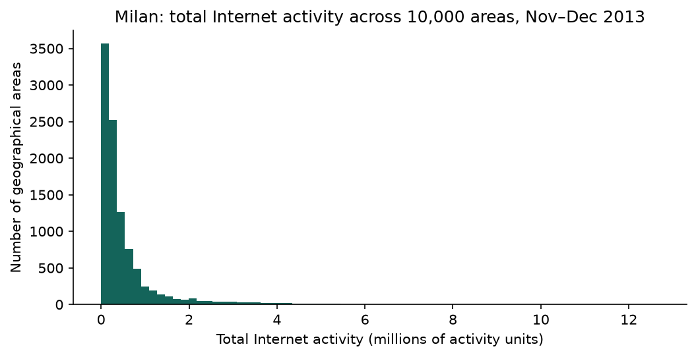

The distribution is right-skewed: median 274,706, 99th percentile 4,666,202, maximum 12,682,673. The top three are **5161, 5059, 5259**, holding 0.62% of total observed activity. Under the assumption that missing bins equal each area's observed mean, the largest adjusted partial-area total is 891,902, below third place (10,436,792). This sensitivity scenario is not an upper bound on missing traffic. Selection uses full-period totals as required, including the evaluation week; it is disclosed selection dependence.

---PAGE---

## 4. Exploratory and temporal analysis

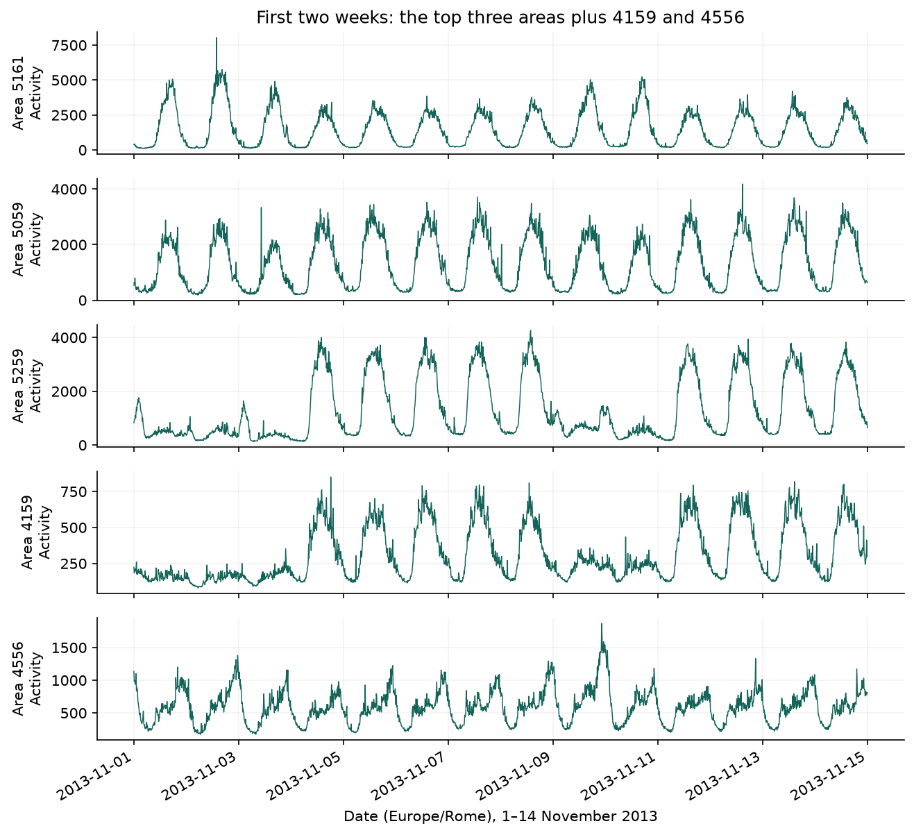

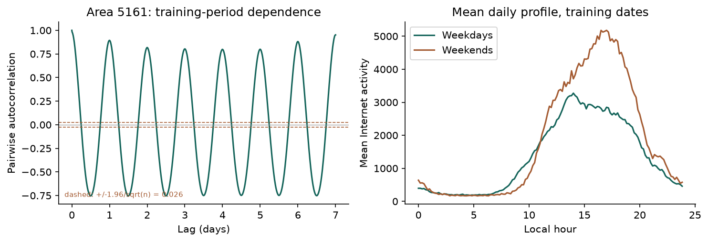

Areas 5259 and 4159 have weekday plateaus and reduced weekend activity. Area 5161 has stronger weekend peaks; 5059 has broad daytime plateaus. Area 4556 contains isolated spikes and lower lag-one correlation, but its coefficient of variation is the lowest of the five. One calendar detail matters for reading the left edge of Figure 2: 1 November 2013 was All Saints' Day, a public holiday in Italy, and it fell on a Friday, so the opening low stretch is a three-day holiday weekend and the 9-10 November weekend is the cleaner comparison. These differences suggest different activity schedules without identifying land use or event causes.

The two additional analyses are temporal dependence and weekday/weekend profiles. Lag-one correlation 0.982 motivates persistence and recent-history inputs; daily 0.894 and weekly 0.952 correlations motivate testing longer histories and future calendar features. Six hours is near zero (-0.017); the half-day trough is at twelve hours (-0.753). These are descriptive correlations, not proof that any architecture will forecast best.

---PAGE---

### 4.1 Statistical characterization

**Table 2. Training-period characteristics; all five selected full-period series have zero missing bins.**

| Area | Mean | CV | Lag 1 | Lag 144 | Weekend/weekday |
| --- | --- | --- | --- | --- | --- |
| 5161 | 1511.4 | 0.92 | 0.982 | 0.894 | 1.36 |
| 5059 | 1342.6 | 0.71 | 0.972 | 0.912 | 0.81 |
| 5259 | 1314.1 | 0.85 | 0.989 | 0.669 | 0.42 |
| 4159 | 317.2 | 0.59 | 0.969 | 0.743 | 0.54 |
| 4556 | 582.4 | 0.43 | 0.943 | 0.769 | 1.14 |

CV is sample standard deviation divided by mean. Area 5161 averages 1847 on weekends and 1357 on weekdays, whereas the weekend/weekday ratio is 0.42 in area 5259. These profiles support separate area-level evaluation. A repeated daily shape need not make yesterday's level a good ten-minute forecast.

On 5,472 complete training values, ADF [8] gives statistic -4.103, p=0.000957. The regression includes a constant; AIC selects 152 lags from a maximum of 168. Expanding the previous 30-lag search changed p from 1.35e-27 to 9.57e-04, demonstrating specification sensitivity. The expanded candidate set permits daily-lag dependence; it is not a universal rule that ADF must include a full seasonal cycle. Both specifications reject the unit-root null under their assumptions. Neither proves strict stationarity or removes seasonal structure; residual diagnostics and further specification checks remain limitations. First-differenced p=3.3e-15 does not by itself justify differencing the forecasting target.

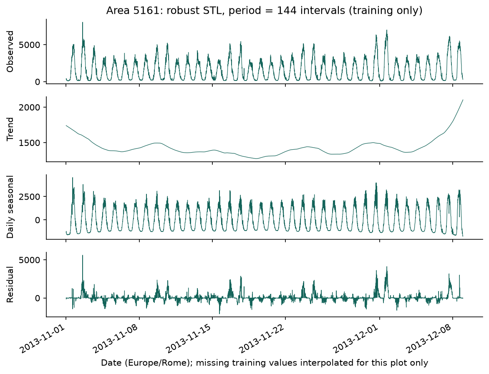

Daily seasonal strength is 0.870, defined as max(0, 1 - Var(residual)/Var(residual + seasonal)). It is not the fraction of all observed variance explained. No training values needed interpolation. STL is descriptive and supplies no model inputs. ADF/STL outputs were recomputed; strong seasonality and rejection of a unit root are compatible.

---PAGE---

## 5. Methodology

A target x(t+1) uses x(t-L+1), ..., x(t), with no future input. A fully observed 144-step history and finite target define eligibility for every candidate, including the earlier L=36 experiments. Missing-valued windows are excluded; an incomplete or unordered timestamp grid is rejected. The same mask prevents differing evaluation subsets. Each selected area has 5,328 training and 1,008 validation/test targets.

**Table 3. Target boundaries in Europe/Rome; end dates are inclusive.**

| Split | Dates | Use |
| --- | --- | --- |
| Training | Nov 1-Dec 8 | Weights and scaling |
| Validation | Dec 9-15 | Settings and stopping |
| Evaluation | Dec 16-22 | Reported rolling one-step errors |

Per-area training mean mu and population standard deviation sigma standardize history to an (L,1) sequence. RidgeAR flattens it to L lag features. All models learn delta=(x(t+1)-x(t))/sigma. Reconstruction is max(0, x(t)+sigma*predicted_delta). Scaling uses only training observations; no target is imputed. Shuffling already formed training windows does not introduce future values. Test history can include newly observed test values for later one-step targets; this is not seven-day recursive forecasting.

**Table 4. Final model structures.**

| Model | Lookback | Structure | Parameters |
| --- | --- | --- | --- |
| RidgeAR | 144 | L2 alpha=10; fitted intercept | 145 |
| LSTM | 144 | 16 gated units; final hidden state | 1169 |
| CausalCNN | 144 | 16 filters; kernel 3; dilations 1,2,4,8,16,32,64 | 4785 |

Ridge minimizes squared correction error plus an L2 coefficient penalty, so regularization favors persistence. LSTM uses sigmoid gates and tanh cell updates with a linear output head, no dropout and no state carried between windows. CausalCNN uses causal ReLU convolutions and a scalar head at the final position. Its theoretical receptive field is 255; only 144 observations are available. Removing dilation 64 reduces the field to 127 and loses access to the oldest 17 observations, so trimming is an ablation, not free removal of unused history.

Neural heads start at zero. Adam uses learning rate 0.001, gradient-norm clipping 1 and batch size 128. Early stopping monitors standardized validation MSE, patience 4, min_delta=1e-5, with an 80-epoch cap. Saved metadata distinguishes the restored epoch from the raw minimum-loss epoch. Weights and scaling are fitted separately per area.

The correction target does not force zero changes: minimizing squared error in delta is equivalent, up to scale, to squared forecast error after reconstruction before clipping. Limited inputs, model capacity, regularization and optimization can affect predictions. Their separate effects require controlled comparisons.

---PAGE---

## 6. Iterative experimentation and revision history

**Table 5. Area 5161, seed 42 validation experiments. These are measured runs, not equal compute budgets.**

| Experiment | Model | Val RMSE | Epochs | Train seconds |
| --- | --- | --- | --- | --- |
| initial | RidgeAR | 159.07 | 0 | 0.021 |
| initial | LSTM | 163.30 | 13 | 4.105 |
| initial | CausalCNN | 161.02 | 20 | 4.514 |
| daily_history | RidgeAR | 153.13 | 0 | 0.051 |
| daily_history | LSTM | 160.26 | 19 | 16.879 |
| daily_history | CausalCNN | 160.28 | 16 | 10.198 |
| capacity | RidgeAR | 152.39 | 0 | 0.041 |
| capacity | LSTM | 162.04 | 9 | 13.023 |
| capacity | CausalCNN | 160.09 | 11 | 9.126 |
| budget | RidgeAR | 152.39 | 0 | 0.040 |
| budget | LSTM | 160.26 | 19 | 17.367 |
| budget | CausalCNN | 160.09 | 11 | 9.251 |

Round 2 improved all models by extending six-hour history to a day. CNN dilation depth also changed, so its improvement cannot be attributed to history alone. Round 3 retained Ridge alpha 10 and LSTM width 16; CNN width 16 reduced RMSE from 160.28 to 160.09. This 0.12% gain justified selection only under the stated minimum-validation-RMSE rule; it does not establish a reliable capacity benefit. Each candidate used one tuning seed.

The original 20-epoch study had already produced test results when a stopping-history audit motivated round 4. Of 30 neural fits, 22 ran 20 epochs; one also triggered patience there, leaving 21 cap-only terminations. Ten had minimum recorded validation loss at the final epoch. The cap did not bind for area 5161 seed 42, but did for its CNN seeds 43 and 44. Increasing it uniformly to 80 is a budget-sensitivity revision, not evidence that finite budgets are inherently incorrect.

All 30 revised neural fits end through patience; the longest runs 55 epochs. No test target enters training or early-stopping loss, but the revised week is not a fresh untouched holdout. Original results remain in commit a5e5111; `revision_provenance.json` records this chronology. Seeds 42-44 are retained, with 42 as the reference convention; available commits do not independently establish when that convention was first chosen.

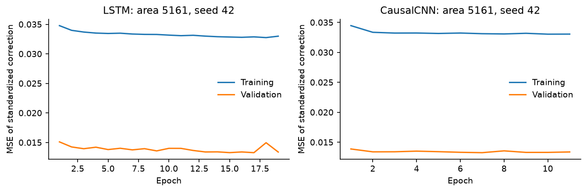

Validation below training loss can reflect different traffic regimes and training-loss averaging during updates. It is not by itself evidence of leakage or proof of convergence.

---PAGE---

## 7. Results and measured computation

**Table 6. Area 5161; seed 42, 1,008 eligible targets.**

| Model (seed 42) | MAE | RMSE | MAPE (%) |
| --- | --- | --- | --- |
| RidgeAR | 85.08 | 124.18 | 9.80 |
| LSTM | 81.13 | 118.42 | 9.09 |
| CausalCNN | 79.96 | 118.16 | 8.36 |
| Persistence | 92.80 | 134.88 | 9.19 |
| Daily seasonal | 338.59 | 619.04 | 25.94 |

**Table 7. Area 5059; seed 42, 1,008 eligible targets.**

| Model (seed 42) | MAE | RMSE | MAPE (%) |
| --- | --- | --- | --- |
| RidgeAR | 71.79 | 99.66 | 7.91 |
| LSTM | 75.46 | 106.22 | 7.78 |
| CausalCNN | 73.96 | 103.49 | 7.61 |
| Persistence | 81.52 | 114.38 | 7.96 |
| Daily seasonal | 171.74 | 245.87 | 18.02 |

**Table 8. Area 5259; seed 42, 1,008 eligible targets.**

| Model (seed 42) | MAE | RMSE | MAPE (%) |
| --- | --- | --- | --- |
| RidgeAR | 65.86 | 93.17 | 7.74 |
| LSTM | 66.84 | 95.02 | 7.82 |
| CausalCNN | 66.64 | 93.61 | 8.21 |
| Persistence | 75.97 | 109.58 | 8.11 |
| Daily seasonal | 470.32 | 861.62 | 71.62 |

MAE and RMSE use every eligible target. MAPE is 100 times mean absolute relative error over nonzero targets, with excluded counts recorded; an all-zero target set yields undefined MAPE. No epsilon is inserted. All five actual evaluation series have 1,008 scored targets and no zero targets. Activity-unit errors are reported after inverse transformation.

**Table 9. Mean timing across five areas and three fits per model.**

| Model | Training (s) | Test batch (ms) | Single (ms) |
| --- | --- | --- | --- |
| CausalCNN | 17.090 | 30.70 | 0.298 |
| LSTM | 23.126 | 34.59 | 2.067 |
| RidgeAR | 0.046 | 0.10 | 0.047 |

Apple M2 Pro, 16 GB RAM, CPU execution, four TensorFlow intra-op threads. Neural training includes construction, compilation and epoch-wise validation; Ridge includes fitting only. These scopes differ. Warm synchronous inference is the median of five full-batch and 30 single-sample calls per fit, then averaged. Windows, scaling and correction reconstruction are excluded. Measurements include local system noise and are not service-latency guarantees.

---PAGE---

## Forecasts for area 5161

Observed and predicted activity use identical timestamps, reference seed 42 and already observed history.

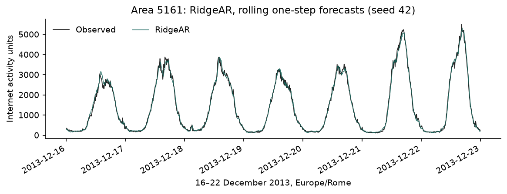

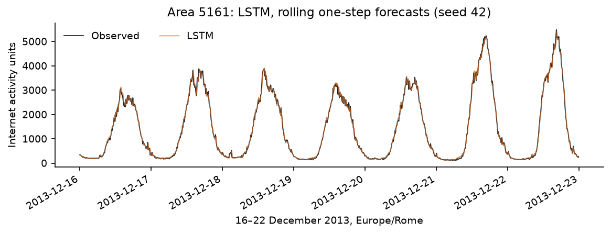

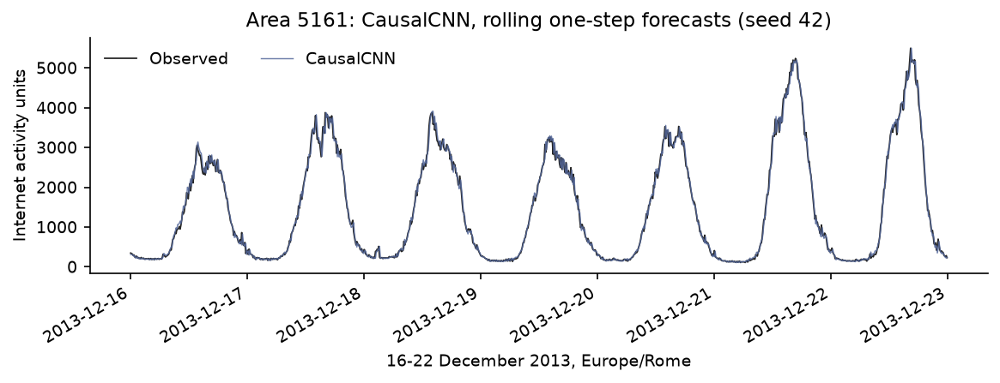

---PAGE---

## Forecasts for area 5059

Observed and predicted activity use identical timestamps, reference seed 42 and already observed history.

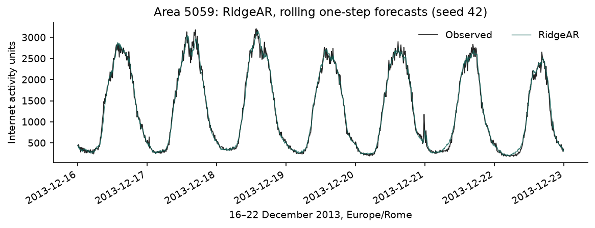

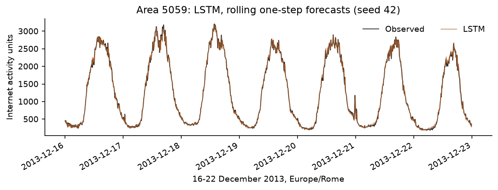

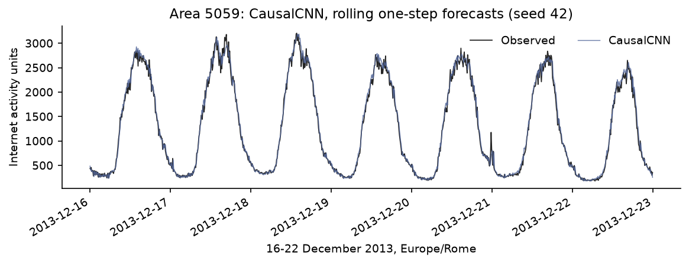

---PAGE---

## Forecasts for area 5259

Observed and predicted activity use identical timestamps, reference seed 42 and already observed history.

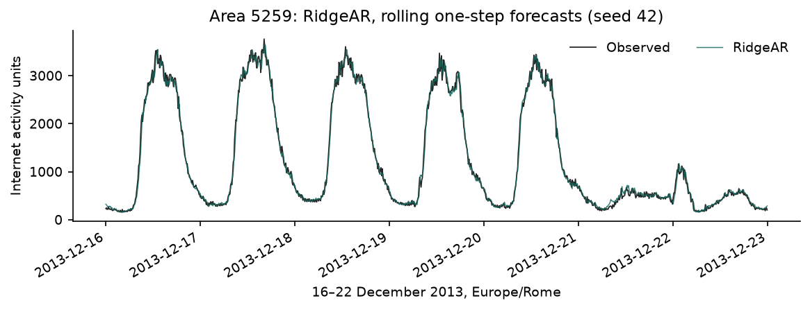

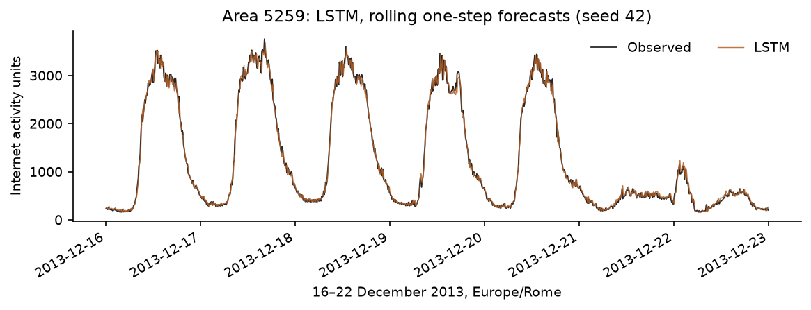

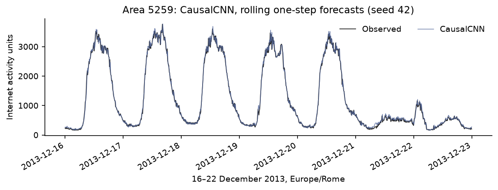

---PAGE---

## 8. Comparative discussion

Fourteen of fifteen reference-seed learned fits have lower RMSE than persistence. Area 4556 LSTM is slightly worse: 39.76 versus 39.62, about 0.35%; this is a small observed loss, not a demonstrated statistical tie. Daily-seasonal persistence is worse in all five areas. This supports the immediate baseline at this horizon; it does not show that seasonal information is useless in a richer model.

**Table 10. Validation/test winners at seed 42 only.**

| Area | Validation best | Test best |
| --- | --- | --- |
| 5161 | RidgeAR | CausalCNN |
| 5059 | CausalCNN | RidgeAR |
| 5259 | CausalCNN | RidgeAR |
| 4159 | LSTM | RidgeAR |
| 4556 | CausalCNN | RidgeAR |

The number of ranking disagreements is 5/5 for seed 42, 2/5 for seed 43 and 2/5 for seed 44. On area 5161, CNN validation RMSE is 160.09, 152.02, 148.03, while Ridge remains 152.39. Thus optimization variation changes the validation winner; the reference-seed reversal cannot be attributed solely to a difference between weeks. Three seeds do not measure uncertainty across future weeks.

**Table 11. Evaluation RMSE mean (sample SD), three seeds.**

| Area | RidgeAR | LSTM | CausalCNN |
| --- | --- | --- | --- |
| 5161 | 124.18 (0.00) | 120.12 (1.93) | 118.49 (2.91) |
| 5059 | 99.66 (0.00) | 101.82 (4.43) | 103.68 (2.58) |
| 5259 | 93.17 (0.00) | 96.05 (1.67) | 91.18 (2.28) |
| 4159 | 19.88 (0.00) | 20.72 (1.26) | 20.15 (0.78) |
| 4556 | 35.57 (0.00) | 42.08 (2.01) | 37.65 (1.15) |

On area 5259, Ridge wins at seed 42, but CNN has the lower three-seed mean. On area 5059, the lower training CV and stronger daily dependence coincide with competitive linear forecasts; five selected areas do not establish a causal link between traffic characteristics and architecture ranking.

**Table 12. Area 5161 signed error by realized-target decile; 101 observations per extreme decile.**

| Model | Low-decile bias | High-decile bias | High-decile MAE |
| --- | --- | --- | --- |
| RidgeAR | +16.4 | -80.8 | 164.4 |
| LSTM | +13.3 | -50.3 | 151.8 |
| CausalCNN | +4.3 | -36.2 | 152.1 |

Across areas, 14/15 high-decile biases are negative and 13/15 low-decile biases positive. These bins condition on realized targets; even an optimal conditional-mean forecast can miss unpredictable extremes in this direction. The pattern is useful for diagnosing capacity-related errors but does not identify the correction target as their cause. A direct-target ablation and prospective threshold-based diagnostics would test that explanation.

---PAGE---

### 8.1 Failure case and limits of the explanation

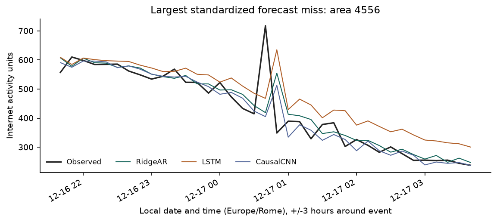

The selected miss is area 4556 at 2013-12-17 00:40 CET. CausalCNN predicts 405.11 against 717.77, an absolute error of 312.66, or 1.24 training SDs. Activity rises from 414.87 to 717.77 and then falls to 348.86. All three models miss the rise and overshoot the fall. The following interval has actual 348.86, compared with RidgeAR 554.76, LSTM 635.22, CausalCNN 512.68.

The spike enters the next window and persistence anchor, which is consistent with the observed lagging response. The correction could in principle cancel that anchor; this single case does not prove an unavoidable architectural failure or that further tuning cannot help. The maximum-error selection is intentionally unrepresentative. No verified event cause is available, and a measurement anomaly remains possible.

A defensible next experiment would compare direct-target and correction-target models under matched validation and compute protocols, then assess abrupt changes on additional periods. Neighboring-area observations may contain predictive information, but that benefit has not been demonstrated. An asymmetric loss could prioritize costly underprediction, with its accuracy/calibration trade-off evaluated separately.

## 9. Conclusion and future work

The busiest area's reference CNN improves RMSE from persistence's 134.88 to 118.16. RidgeAR remains competitive at much lower measured computation cost. Rankings depend on area, seed and week, so no architecture is declared universally best.

The main limitations are one reused evaluation week, full-period area selection, hyperparameters developed mainly on one area/seed, partial aggregation coverage and unequal training scopes. Next steps are prospective area selection, rolling-origin evaluation with explicitly reserved periods, matched-budget comparisons and input/target ablations. Daily and weekly dependence motivate calendar or longer-history features, but their value must be tested rather than inferred from correlation alone.

---PAGE---

## AI assistance disclosure

OpenAI Codex and other AI assistance contributed substantially to code, experimental design, model implementation, testing, analysis, figures and report drafting, including the subsequent audit and corrections. The numerical results derive from the published dataset; artificial values are used in tests only. This disclosure describes assistance and does not attest to independent student authorship or demonstrated understanding. The student remains responsible for reviewing and explaining the submitted work under the course policy.

## References

[1] G. Barlacchi et al., "A multi-source dataset of urban life in the city of Milan and the Province of Trentino," Scientific Data, vol. 2, art. 150055, 2015, doi: 10.1038/sdata.2015.55. https://doi.org/10.1038/sdata.2015.55.

[2] A. Azari, P. Papapetrou, S. Denic, and G. Peters, "Cellular Traffic Prediction and Classification: a comparative evaluation of LSTM and ARIMA," arXiv:1906.00939, 2019. https://arxiv.org/abs/1906.00939.

[3] S. Bai, J. Z. Kolter, and V. Koltun, "An Empirical Evaluation of Generic Convolutional and Recurrent Networks for Sequence Modeling," arXiv:1803.01271, 2018. https://arxiv.org/abs/1803.01271.

[4] C. Zhang and P. Patras, "Long-Term Mobile Traffic Forecasting Using Deep Spatio-Temporal Neural Networks," arXiv:1712.08083, 2017. https://arxiv.org/abs/1712.08083.

[5] Telecom Italia, "Telecommunications - SMS, Call, Internet - MI," Harvard Dataverse, 2015, doi: 10.7910/DVN/EGZHFV. https://doi.org/10.7910/DVN/EGZHFV. ODbL 1.0; attribution and terms are retained in DATA_LICENSE.md.

[6] C. Tonny, "ML Techniques I formative assignment: source code and reproducibility materials," GitHub. [Repository](https://github.com/irachrist1/ml-techniques-1-formative-1).

[7] Individual project video: Recording and accessible link pending; no video is included in this version.

[8] statsmodels developers, "adfuller: Augmented Dickey-Fuller unit root test," statsmodels documentation. https://www.statsmodels.org/stable/generated/statsmodels.tsa.stattools.adfuller.html.

[9] statsmodels developers, "acf: Autocorrelation function," statsmodels documentation. https://www.statsmodels.org/stable/generated/statsmodels.tsa.stattools.acf.html.

[10] R. B. Cleveland, W. S. Cleveland, J. E. McRae, and I. Terpenning, "STL: A Seasonal-Trend Decomposition Procedure Based on Loess," Journal of Official Statistics, vol. 6, no. 1, pp. 3-73, 1990. Method implemented by statsmodels STL: https://www.statsmodels.org/stable/generated/statsmodels.tsa.seasonal.STL.html.
